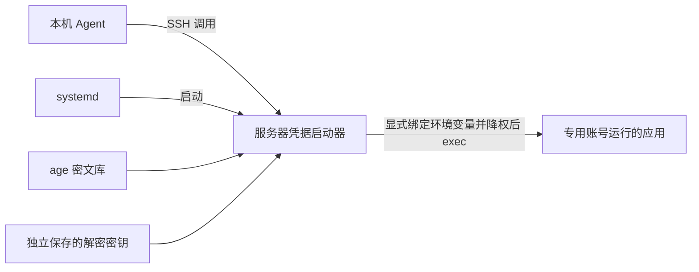

# server-port-deploy

[](https://github.com/Huuuhuuhu/server-port-deploy/actions/workflows/check.yml)

一个面向 Linux 服务器的部署技能，可供 Codex、Claude Code 等支持 Agent Skills 的工具使用。提供项目、服务器和域名信息后，Agent 按默认规则部署或更新应用，配置 HTTPS、维护中文记录，并按需管理服务器上的加密凭据。

技能由部署指令、参考文档和 Python 工具组成。Agent 读取 [SKILL.md](SKILL.md)，结合项目实际情况执行部署；工具负责登记表更新、Nginx 配置生成和凭据操作。仓库中的内容是工具与模板，实际部署记录、密文和解密密钥保存在目标服务器。

[安装与开始使用](#安装与开始使用) · [部署规则](#部署规则) · [凭据如何使用](#凭据如何使用) · [工具与文档](#工具与文档) · [测试与检查](#测试与检查)

## 能做什么

| 场景 | 技能提供的能力 |
| --- | --- |
| 首次上线 | 阅读项目部署说明，核实运行依赖、启动方式、入口、持久化数据和凭据，验证适配方案后部署 |
| 域名与端口管理 | 优先复用现有入口；区分用户端口、Nginx 监听端口和后端端口，结合实际监听检查冲突 |
| Nginx 与 HTTPS | 生成代理配置草稿，支持 HTTPS、HTTP 跳转、WebSocket 和 SSE；指导证书配置与入口验证 |
| 已有服务更新 | 在固定项目目录更新代码和依赖，保留业务数据与既有入口，验证实际运行结果 |
| 中文运维交接 | 维护部署登记表和凭据元数据目录，记录实际版本、路径、验证结果与安全状态 |
| API Key 等凭据管理 | 通过标准输入加密入库，按项目和环境组织，支持存在性检查、替换、备份与应用启动注入 |

适合个人服务器或多应用 Linux 主机上的网站、API 服务、AI 翻译器及其他 Web 应用。Web 入口默认使用 Nginx，也可以沿用满足要求的既有网关；具体选择由项目需求和服务器现状决定。复杂的多主机编排、集中授权和密钥审计需要额外方案。

## 安装与开始使用

### 运行条件

| 位置 | 要求 |
| --- | --- |
| 本机 Agent | 支持 Agent Skills 的环境，以及读取项目、执行命令和通过 SSH 连接目标服务器的能力 |
| 目标服务器 | Linux、Python 3.9+，以及项目需要的运行时、进程管理方式和入口；默认使用 Nginx |
| 凭据功能 | 服务器上安装 `age` 和 `age-keygen`；仅在需要凭据库时初始化 |
| 公网 HTTPS | 与预期域名或地址匹配的有效证书、正确的解析与路由，以及匹配的安全组/防火墙规则 |

本机可以使用 Windows、macOS 或 Linux。凭据权限检查和应用降权面向 Linux 服务器；在 Windows 上运行部分脚本不能替代 Linux 权限验证。安装技能后，服务器依赖和应用配置仍需在部署任务中落实。

### 安装技能

直接把仓库地址发给你使用的 Agent：

```text
帮我安装这个技能：https://github.com/Huuuhuuhu/server-port-deploy
```

核心使用通用的 `SKILL.md`、脚本和参考文档结构，脚本不依赖某家 Agent 的 SDK。`agents/openai.yaml` 是 Codex 的界面元数据，其他 Agent 使用核心技能不依赖它。格式与调用方式可参考 [Codex 文档](https://developers.openai.com/zh-Hans/docs/build-skills) 和 [Claude Code 文档](https://code.claude.com/docs/en/skills)。实际执行仍取决于 Agent 的工具、网络和权限；当前 CI 验证辅助脚本，不覆盖不同 Agent 的完整部署过程。

### 发起部署任务

通常只需提供这些信息：

```text
把 translator 项目部署到我的服务器。
服务器信息：server-a（已配置 SSH）
域名：translate.example.com（已创建）
```

Agent 会自行阅读项目说明、检查服务器和 DNS，按默认规则处理 HTTPS、入口、数据保留、必要凭据、验证及中文记录。能查到或已有约定的信息不再要求你重复填写；缺少关键访问权限、凭据或存在无法判断的冲突时，才补问必要信息。

更新时也可以直接说“把服务器上的 translator 更新到当前版本”。需要明确指定技能时，Codex 使用 `$server-port-deploy`，Claude Code 使用 `/server-port-deploy`；不必把默认步骤逐项写进请求。

## 部署规则

### 先理解项目，再验证适配

项目自带的部署文档和启动配置用于确认运行条件；没有部署文档时，从依赖、启动配置和代码核实。Agent 需要区分项目的硬性要求与默认建议，再通过项目支持的配置、环境变量、启动参数、代理或容器映射适配用户要求和技能规范。

用户明确要求优先于技能默认值。项目文档不会自动覆盖这些要求，项目真正依赖的硬性条件也不能被忽略。只有两者都能满足并完成必要验证，才继续部署。

存在根本冲突或关键适配无法验证时，阻断依赖该方案的线上代码修改、服务启动和入口开放，说明要求出处、冲突、已尝试的方式及证据。已有服务保持原状态；可以继续只读检查和独立准备工作。完整规则见 [项目部署文档的适配规则](SKILL.md#项目部署文档的适配规则)。

### 入口和端口

普通 Web 应用默认采用：用户 → Nginx → 本机后端服务。Nginx 负责接收请求、处理 HTTPS 和转发，应用进程由 systemd、Compose 等方式运行。更新时优先保留已有入口；新建域名入口优先共享 80/443，按域名分流。

并非每个项目或组件都需要套用同一份 Nginx 配置：

| 情况 | 处理方式 |
| --- | --- |
| 普通 HTTP API、WebSocket、SSE | 默认使用 Nginx，按协议配置代理 |
| 已有 Caddy、Traefik 或项目自带网关 | 验证满足 HTTPS、访问控制和项目约束后沿用，避免重复接管入口 |
| 项目中的后台 worker、定时任务 | 没有 HTTP 入口的组件无需反向代理，按实际任务方式运行 |
| gRPC、TCP/UDP 服务或特殊网关要求 | 单独核实协议、模块与部署方式，不能直接套用当前 HTTP 配置生成器 |

Nginx 本身提供 [gRPC](https://nginx.org/en/docs/http/ngx_http_grpc_module.html) 和 [TCP/UDP 代理](https://nginx.org/en/docs/stream/ngx_stream_proxy_module.html)能力，但本仓库的生成器只覆盖常见 HTTP 反向代理配置。需要其他方式时，仍须满足用户要求和项目硬性条件；适配不可行或无法验证时阻断部署，不能直接照搬项目默认方案。

| 用途 | 默认建议 |
| --- | --- |
| HTTP 入口 | 80，可用于 HTTPS 跳转或证书验证 |
| HTTPS 入口 | 443，多个域名可共享 |
| 额外独立公共入口 | 12001–12999，按实际用途与访问控制选择 |
| 后端服务 | 18001–18999，默认绑定 `127.0.0.1` |

这些范围是建议，实际可用性必须结合登记表、监听进程和 Nginx 配置核实。`find-free` 只排除登记表和调用者显式提供的已用端口，不探测或预留系统端口。负载均衡、NAT 和容器映射场景还需分别核对各层地址。

**公网 Web 入口默认配置 HTTPS，无需用户额外提出。** Agent 会核验域名解析，复用或申请有效证书，并检查续期与实际访问。已有网关负责 TLS 时，验证完整访问链路即可；本机回环上的 HTTP 后端可以保持原方式。

确实暂时做不到 HTTPS 时，说明具体原因、已验证的替代方式和实际访问范围。只有未被明确要求必须使用 HTTPS、且不承载登录、私密数据或付费模型调用等敏感能力的入口，才可在确认暴露面可接受后记录为 HTTP 例外；其余情况阻断公网业务开放，继续本机或受限验证。详见 [入口与 HTTPS 策略](references/nginx-port-mode.md)。

### 项目目录与更新

新项目默认放在**部署账号家目录下的 `apps/项目名/`**，代码直接放在项目目录里。root 部署时，例如：

```text
/root/
├── apps/
│   ├── translator/       # 项目代码、依赖和启动配置
│   │   ├── data/         # 需要时保存业务数据
│   │   └── uploads/      # 需要时保存上传文件
│   └── another-project/
├── server-deployments.md
└── server-credentials.md  # 使用凭据库时生成
```

普通账号使用其实际家目录。项目原有结构保持不变，数据目录按需创建；已有应用沿用核实后的实际位置，不会仅为统一目录而自动搬迁。部署账号与应用运行账号分别设置，root 部署也须满足应用账号权限和隔离要求。

更新直接在固定项目目录进行，不建立 `releases/`、`current`、`previous`，不保留多版本代码，也不设计自动回退。业务数据、上传文件和本机配置排除出代码覆盖与清理范围；凭据库、解密密钥在应用代码树外保存。需要覆盖运行文件时会先停止该应用，因此更新可能短暂停机。

验证覆盖进程、本机后端、实际入口、外部访问，以及登录或最小业务行为。失败时检查并修复；无法解决就停止继续发布，如实报告当前状态。数据库迁移、凭据保护和入口配置校验仍按项目实际要求处理。操作细节见 [应用目录与原目录更新](references/update-existing-deployment.md)。

## 会生成和维护哪些文件

| 文件或目录 | 内容 |
| --- | --- |
| 部署账号的 `~/apps/<project>/` | 固定项目目录，直接保存代码、依赖和启动配置；按需保留数据目录 |
| 部署账号的 `~/server-deployments.md` | 中文部署登记表：访问地址、端口、服务单元、配置位置、安全措施、凭据引用，以及实际版本、数据位置和验证结果 |
| 部署账号的 `~/server-credentials.md` | 按需生成的中文凭据目录：引用、用途、类型及时间等元数据，不保存真实值 |
| `/var/lib/server-port-deploy/credentials/` | 多应用服务器建议使用的 root 管理密文库，按 `project/environment.age` 保存 |
| `/etc/server-port-deploy/identity.txt` | 独立保管的 age 解密密钥，与密文分开备份 |
| `/usr/local/lib/server-port-deploy/` | 服务器上的稳定工具目录，应用账号不能修改，避免启动器受临时技能目录或应用代码更新影响 |

文档标题、说明、用途、安全措施、备注和交付报告要求使用中文。项目标识、路径、域名、变量名和 JSON 机器字段保持原样；历史自由文本不会由脚本自动翻译。

登记工具兼容已知的旧英文表头，迁移前备份，保留表外备注；无法识别的表结构会拒绝改写。凭据目录是 `catalog` 生成的快照，入库和轮换后需刷新。实际文件权限与初始化方式见 [凭据存储与接入](references/credentials.md)。

沿用其他网关时，登记使用 `upsert --no-nginx`，Nginx 专属字段留空，在备注中记录实际入口及配置位置。项目的无入口组件记入相关部署备注，不为填表虚构域名或端口。

## 凭据如何使用

### 本机 Agent 与服务器应用共用服务器存储

`credentials.py` 调用 age 加密凭据，使用 `project/environment/name` 引用定位。以 `translator/prod/dashscope-api-key` 为例，它表示一个项目、环境和凭据名称，引用本身不包含 Key。

在 root 管理凭据库、应用使用独立账号的 systemd 方案中，调用关系如下：



本机 Agent 默认让消费凭据的命令在服务器执行。服务器应用由本机启动器注入所需变量，启动和运行均不依赖用户电脑在线。应用需支持从环境变量读取配置，或提供自己的适配代码；systemd、Docker 和 SDK 不会自动解析 `secret://` 引用。

工具支持的操作：

| 操作 | 行为 |
| --- | --- |
| `init` | 初始化库与 identity；已有密文却缺少 identity 时拒绝生成新密钥 |
| `put --stdin` | 从标准输入读取真实值并加密；同名替换须显式加 `--replace` |
| `list` / `catalog` | 输出元数据，或生成中文目录，不输出真实值 |
| `check` | 检查指定凭据存在且可解密；服务商是否仍接受它需要业务验证 |
| `exec --bind ENV=NAME` | 把选定凭据绑定到子进程环境变量后启动命令；缺少凭据或解密失败时不启动 |
| `exec --as-user USER` | root 启动器解密后切换附加组、GID 和 UID，再执行应用 |
| `backup` | 备份密文到新目录，不复制 identity；恢复流程另见参考文档 |

值按 UTF-8 原样保存，保留大小写、标点、空白和换行。秘密值不写入 Git、Markdown、命令参数、日志或前端包；高德 JS API Key 等浏览器公开标识按服务商规则接入，不能与服务端秘密混淆。应用用户登录密码的认证存储应使用成熟密码哈希；加密库用于需要取回使用的第三方凭据。

### 权限边界

**项目和环境分组只用于组织、选择和校验数据，不是应用访问控制。** 同一 Linux 账号下的应用不能仅靠分组和加密隔离彼此的凭据。

- 需要隔离时，使用 root 管理的库和 identity，为应用分配不同的非 root 账号，限制文件、目录、启动器及服务配置的权限，并验证实际 UID/GID、附加组和访问拒绝结果。无法满足隔离要求时阻断部署。
- root、凭据管理员或同时持有密文与解密密钥的人仍能解密；应用也能读取它已经收到的凭据。只有明确接受同账号互信的场景才采用共享账号，并记录限制。
- `--bind` 不是权限白名单。启动器会继承调用进程环境，因此启动环境也必须受控，避免把管理 shell 中其他项目的秘密带入应用。工具没有明文 `get` 命令，但无法阻止子进程主动输出自己收到的值。
- Compose 的环境变量兼容方案会将明文保存在容器运行配置中，Docker 管理者可读取；不能把它描述为全程只在内存。应用不得获得 Docker socket 或任意提权能力。

完整的安装、SSH 调用、systemd/Compose 接入、凭据类型、轮换和恢复示例集中在 [凭据存储与接入](references/credentials.md)。当前工具不提供自动 rekey、多主机同步或集中审计服务。

## 工具与文档

以下命令在技能源目录运行，只显示帮助：

```bash
python3 scripts/registry.py --help
python3 scripts/render_nginx.py --help
python3 scripts/credentials.py --help
```

| 入口 | 用途 |
| --- | --- |
| [SKILL.md](SKILL.md) | Agent 的技能入口：约定、文档适配规则、部署流程和交付要求 |
| [registry.py](scripts/registry.py) | 部署登记表的 `init`、`list`、`get`、`find-free`、`upsert`；支持锁、原子写入和已知旧格式迁移 |
| [render_nginx.py](scripts/render_nginx.py) | 生成 HTTP/HTTPS、WebSocket、SSE 配置草稿；负责生成，不执行安装、证书申请或重载 |
| [credentials.py](scripts/credentials.py) | age 凭据库、元数据、备份和应用启动注入 |
| [safe_io.py](scripts/safe_io.py) | 供其他脚本使用的锁、原子写入及路径与权限检查 |
| [中文登记表模板](references/server-deployments-template.md) | 部署表字段与端口约定 |
| [Nginx 配置与验证](references/nginx-port-mode.md) | 域名、证书、代理配置与分层验证 |
| [应用目录与原目录更新](references/update-existing-deployment.md) | 家目录下的 apps 布局、原目录更新、数据保护与验证 |
| [凭据存储与接入](references/credentials.md) | 凭据生命周期、接入示例和权限限制 |

全局参数放在子命令前，例如 `--registry`、`--store` 和 `--identity`。登记脚本由实际部署账号运行；root 使用 `--allow-root --registry /root/server-deployments.md`，避免临时提权后误写另一账号的登记表。机器读取可用 `registry.py list --json` 或 `get`，字段保持英文。

## 测试与检查

[GitHub Actions](https://github.com/Huuuhuuhu/server-port-deploy/actions/workflows/check.yml) 在推送和 Pull Request 时运行回归检查，使用临时 Ubuntu 24.04 环境和 Python 3.9、3.13、3.14。页面中的 `linux (3.9)` 等名称表示使用不同 Python 版本的任务。CI 依赖固定到已核实的提交，并设置运行超时。

测试覆盖登记表迁移、异常输入与并发更新，Nginx 配置生成、输入校验和真实配置校验，age 加解密、错误路径与上层目录权限处理、同账号跨项目访问，以及 root 启动器降权后的文件访问限制。测试使用临时文件和合成凭据。

在用于测试的 Linux 环境中，从仓库根目录运行：

```bash
python3 -m unittest discover -s tests -v
```

缺少 age 或 Nginx 时，相关集成检查可能跳过；普通账号也会跳过需要 root 的检查。完整验证所需工具、强制依赖检查和 root 阶段见 [CI 配置](.github/workflows/check.yml)，应在隔离的测试环境中运行。

CI 通过说明被测试的行为在测试环境通过。目标服务器上的域名、证书、外部访问、服务商凭据有效性和应用权限隔离，仍须在每次实际部署时核验并如实记录。
