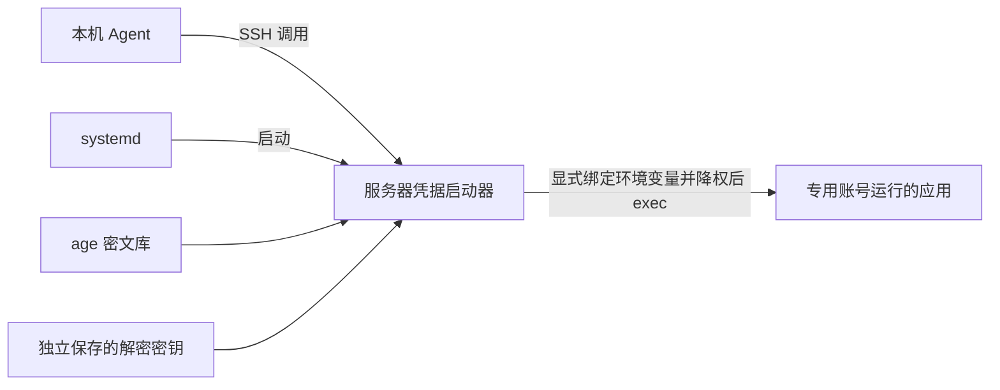

# server-port-deploy

[](https://github.com/Huuuhuuhu/server-port-deploy/actions/workflows/check.yml)

一个面向 Linux 服务器的 Codex 技能：通过 Nginx 部署与更新 Web/API 应用，维护中文部署记录，并用 age 集中加密保存应用凭据，供本机 Agent 和服务器应用使用。

技能由部署指令、参考文档和 Python 工具组成。Agent 读取 [SKILL.md](SKILL.md)，结合项目实际情况执行部署；工具负责登记表更新、Nginx 配置生成和凭据操作。仓库中的内容是工具与模板，实际部署记录、密文和解密密钥保存在目标服务器。

[安装与开始使用](#安装与开始使用) · [部署规则](#部署规则) · [凭据如何使用](#凭据如何使用) · [工具与文档](#工具与文档) · [测试与检查](#测试与检查)

## 能做什么

| 场景 | 技能提供的能力 |
| --- | --- |
| 首次上线 | 阅读项目部署说明，核实运行依赖、启动方式、入口、持久化数据和凭据，验证适配方案后部署 |
| 域名与端口管理 | 优先复用现有入口；区分用户端口、Nginx 监听端口和后端端口，结合实际监听检查冲突 |
| Nginx 与 HTTPS | 生成代理配置草稿，支持 HTTPS、HTTP 跳转、WebSocket 和 SSE；指导证书配置与入口验证 |
| 已有服务更新 | 先构建新版本再切换，保留数据、既有入口和可恢复的旧版本，失败时按实际情况回滚 |
| 中文运维交接 | 维护部署登记表和凭据元数据目录，记录版本、路径、验证结果、安全状态与恢复位置 |
| API Key 等凭据管理 | 通过标准输入加密入库，按项目和环境组织，支持存在性检查、替换、备份与应用启动注入 |

适合使用 Nginx 作为入口的个人服务器或多应用 Linux 主机，例如网站、API 服务、AI 翻译器及需要调用模型的后端。具体应用仍须具备可验证的运行方式；复杂的多主机编排、集中授权和密钥审计需要额外方案。

## 安装与开始使用

### 运行条件

| 位置 | 要求 |
| --- | --- |
| 本机 Agent | 支持技能的 Codex 环境，以及访问项目、执行命令和连接目标服务器的能力；手动克隆时需要 Git |
| 目标服务器 | Linux、Python 3.9+、Nginx，以及项目实际需要的运行时和进程管理方式 |
| 凭据功能 | 服务器上安装 `age` 和 `age-keygen`；仅在需要凭据库时初始化 |
| 公网 HTTPS | 可用域名、正确的 DNS、有效证书和匹配的安全组/防火墙规则 |

本机可以使用 Windows、macOS 或 Linux。凭据权限检查和应用降权面向 Linux 服务器；在 Windows 上运行部分脚本不能替代 Linux 权限验证。安装技能后，服务器依赖和应用配置仍需在部署任务中落实。

### 安装技能

在 Codex 中让内置安装器从这个仓库安装，仓库根目录就是技能目录：

```text
$skill-installer 从 https://github.com/Huuuhuuhu/server-port-deploy 安装根目录的技能，技能目录名使用 server-port-deploy。
```

也可以手动安装。按照当前 Codex 官方文档，用户级技能可放在 `~/.agents/skills`，项目级技能可放在项目的 `.agents/skills`；安装器和发现规则见 [OpenAI 官方技能文档](https://developers.openai.com/zh-Hans/docs/build-skills)。以下命令用于目标目录尚不存在的首次安装。

macOS / Linux：

```bash
mkdir -p "$HOME/.agents/skills"
git clone https://github.com/Huuuhuuhu/server-port-deploy.git "$HOME/.agents/skills/server-port-deploy"
```

Windows PowerShell：

```powershell
$skillPath = Join-Path $HOME '.agents\skills\server-port-deploy'
New-Item -ItemType Directory -Force -Path (Split-Path $skillPath) | Out-Null
git clone https://github.com/Huuuhuuhu/server-port-deploy.git $skillPath
```

已安装时先确认现有目录和本地修改，避免重复安装或覆盖自定义内容。安装后可在任务中显式使用 `$server-port-deploy`；如果技能尚未显示，重启 Codex 后再检查。完整目录需包含 `SKILL.md`、`scripts/` 和 `references/`，不要只复制入口文件。

### 发起部署任务

把项目位置、服务器 SSH 别名、预期域名、环境和访问控制要求告诉 Agent。已有服务还应提供已知部署位置、需要保留的数据和可接受的切换窗口；现有配置里的敏感值应通过已授权的受保护通道处理。

首次部署：

```text
$server-port-deploy
把当前项目部署到 SSH 别名 server-a 对应的 Linux 服务器，使用 translate.example.com。
先参考项目部署文档，验证能否适配本技能的规范。
这是需要登录的 AI 服务，请配置 HTTPS，并维护中文部署记录。
```

更新已有服务：

```text
$server-port-deploy
把服务器上已部署的 translator 更新到当前已确认版本。
沿用现有域名和端口，保留数据库、上传文件和凭据，验证成功后更新中文记录。
请保留上一个可恢复版本，并说明回滚位置。
```

整理凭据并接入应用：

```text
$server-port-deploy
检查当前服务器上 translator 所需 API Key 的保存位置和接入方式，不输出真实值。
把已确认属于该应用的凭据接入服务器加密库，让服务启动时读取所需环境变量。
应用之间需要隔离，请使用独立运行账号并验证权限，再更新中文凭据目录。
```

这些名称仅用于示范任务描述，执行时以用户提供的信息及服务器实际状态为准。

## 部署规则

### 先理解项目，再验证适配

项目自带的部署文档和启动配置用于确认运行条件。Agent 需要区分项目的硬性要求与默认建议，再通过项目支持的配置、环境变量、启动参数、代理或容器映射适配用户要求和技能规范。

用户明确要求优先于技能默认值。项目文档不会自动覆盖这些要求，项目真正依赖的硬性条件也不能被忽略。只有两者都能满足并完成必要验证，才继续部署。

存在根本冲突或关键适配无法验证时，阻断依赖该方案的线上启动、版本切换和入口开放，说明要求出处、冲突、已尝试的方式及证据。已有服务保持原状态；可以继续只读检查和独立准备工作。完整规则见 [项目部署文档的适配规则](SKILL.md#项目部署文档的适配规则)。

### 入口和端口

默认访问结构为：用户 → Nginx → 本机后端服务。更新时优先保留原域名、端口和服务单元；新建服务有域名且具备 TLS 条件时，优先共享 80/443，按域名分流。

| 用途 | 默认建议 |
| --- | --- |
| HTTP 入口 | 80，可用于 HTTPS 跳转或证书验证 |
| HTTPS 入口 | 443，多个域名可共享 |
| 额外独立公共入口 | 12001–12999，按实际用途与访问控制选择 |
| 后端服务 | 18001–18999，默认绑定 `127.0.0.1` |

这些范围是建议，实际可用性必须结合登记表、监听进程和 Nginx 配置核实。`find-free` 只排除登记表和调用者显式提供的已用端口，不探测或预留系统端口。负载均衡、NAT 和容器映射场景还需分别核对各层地址。

承载登录、私密数据或付费模型调用的公网入口，需要 TLS 和适当的认证/授权。配置生成器输出的是草稿，证书签发、应用专属访问控制、配置安装与重载由部署流程落实。详见 [Nginx 配置与验证](references/nginx-port-mode.md)。

### 更新和验证

推荐先在新的 release 目录完成依赖安装和构建，保留持久化数据，再切换当前版本并验证。默认保留当前版本、上一个已验证版本和恢复所需配置；凭据库、解密密钥、数据库与上传文件独立保存。

验证覆盖进程状态、本机后端、正确域名和协议的 Nginx 入口、外部访问，以及登录或最小业务行为。失败后按实际更新方式恢复并报告状态。数据库迁移需另行确认兼容性，切回旧代码不能撤销不可逆的数据变化。操作细节见 [已有部署的安全更新](references/update-existing-deployment.md)。

## 会生成和维护哪些文件

| 文件或目录 | 内容 |
| --- | --- |
| 部署账号的 `~/server-deployments.md` | 中文部署登记表：访问地址、端口、服务单元、配置位置、安全措施、凭据引用，以及备注中的版本、数据和回滚信息 |
| 部署账号的 `~/server-credentials.md` | 按需生成的中文凭据目录：引用、用途、类型及时间等元数据，不保存真实值 |
| `/var/lib/server-port-deploy/credentials/` | 多应用服务器建议使用的 root 管理密文库，按 `project/environment.age` 保存 |
| `/etc/server-port-deploy/identity.txt` | 独立保管的 age 解密密钥，与密文分开备份 |
| `/usr/local/lib/server-port-deploy/` | 服务器上的稳定工具目录，应用账号不能修改，避免服务依赖临时技能目录或待清理的 release |

文档标题、说明、用途、安全措施、备注和交付报告要求使用中文。项目标识、路径、域名、变量名和 JSON 机器字段保持原样；历史自由文本不会由脚本自动翻译。

登记工具兼容已知的旧英文表头，迁移前备份，保留表外备注；无法识别的表结构会拒绝改写。凭据目录是 `catalog` 生成的快照，入库和轮换后需刷新。实际文件权限与初始化方式见 [凭据存储与接入](references/credentials.md)。

## 凭据如何使用

### 本机 Agent 与服务器应用共用服务器存储

`credentials.py` 调用 age 加密凭据，使用 `project/environment/name` 引用定位。以 `translator/prod/dashscope-api-key` 为例，它表示一个项目、环境和凭据名称，引用本身不包含 Key。

在 root 管理凭据库、应用使用独立账号的 systemd 方案中，调用关系如下：



本机 Agent 默认让消费凭据的命令在服务器执行。服务器应用由本机启动器注入所需变量，启动和运行均不依赖用户电脑在线。应用需支持从环境变量读取配置，或提供自己的适配代码；systemd、Docker 和 SDK 不会自动解析 `secret://` 引用。

工具支持的操作：

| 操作 | 行为 |
| --- | --- |
| `init` | 初始化库与 identity；已有密文却缺少 identity 时拒绝生成新密钥 |
| `put --stdin` | 从标准输入读取真实值并加密；同名替换须显式加 `--replace` |
| `list` / `catalog` | 输出元数据，或生成中文目录，不输出真实值 |
| `check` | 检查指定凭据存在且可解密；服务商是否仍接受它需要业务验证 |
| `exec --bind ENV=NAME` | 把选定凭据绑定到子进程环境变量后启动命令；缺少凭据或解密失败时不启动 |
| `exec --as-user USER` | root 启动器解密后切换附加组、GID 和 UID，再执行应用 |
| `backup` | 备份密文到新目录，不复制 identity；恢复流程另见参考文档 |

值按 UTF-8 原样保存，保留大小写、标点、空白和换行。真实值不写入 Git、Markdown、命令参数或日志。应用用户登录密码的认证存储应使用成熟密码哈希；加密库用于需要取回使用的第三方凭据。

### 权限边界

**项目和环境分组只用于组织、选择和校验数据，不是应用访问控制。** 同一 Linux 账号下的应用不能仅靠分组和加密隔离彼此的凭据。

- 需要隔离时，使用 root 管理的库和 identity，为应用分配不同的非 root 账号，限制文件、目录、启动器及服务配置的权限，并验证实际 UID/GID、附加组和访问拒绝结果。无法满足隔离要求时阻断部署。
- root、凭据管理员或同时持有密文与解密密钥的人仍能解密；应用也能读取它已经收到的凭据。只有明确接受同账号互信的场景才采用共享账号，并记录限制。
- `--bind` 不是权限白名单。启动器会继承调用进程环境，因此启动环境也必须受控，避免把管理 shell 中其他项目的秘密带入应用。工具没有明文 `get` 命令，但无法阻止子进程主动输出自己收到的值。
- Compose 的环境变量兼容方案会将明文保存在容器运行配置中，Docker 管理者可读取；不能把它描述为全程只在内存。应用不得获得 Docker socket 或任意提权能力。

完整的安装、SSH 调用、systemd/Compose 接入、凭据类型、轮换和恢复示例集中在 [凭据存储与接入](references/credentials.md)。当前工具不提供自动 rekey、多主机同步或集中审计服务。

## 工具与文档

以下命令在技能源目录运行，只显示帮助：

```bash
python3 scripts/registry.py --help
python3 scripts/render_nginx.py --help
python3 scripts/credentials.py --help
```

| 入口 | 用途 |
| --- | --- |
| [SKILL.md](SKILL.md) | Agent 的技能入口：约定、文档适配规则、部署流程和交付要求 |
| [registry.py](scripts/registry.py) | 部署登记表的 `init`、`list`、`get`、`find-free`、`upsert`；支持锁、原子写入和已知旧格式迁移 |
| [render_nginx.py](scripts/render_nginx.py) | 生成 HTTP/HTTPS、WebSocket、SSE 配置草稿；负责生成，不执行安装、证书申请或重载 |
| [credentials.py](scripts/credentials.py) | age 凭据库、元数据、备份和应用启动注入 |
| [safe_io.py](scripts/safe_io.py) | 供其他脚本使用的锁、原子写入及路径与权限检查 |
| [中文登记表模板](references/server-deployments-template.md) | 部署表字段与端口约定 |
| [Nginx 配置与验证](references/nginx-port-mode.md) | 域名、证书、代理配置与分层验证 |
| [已有部署的安全更新](references/update-existing-deployment.md) | release 切换、数据保护、恢复与清理 |
| [凭据存储与接入](references/credentials.md) | 凭据生命周期、接入示例和权限限制 |

全局参数放在子命令前，例如 `--registry`、`--store` 和 `--identity`。登记脚本默认由普通部署账号运行；root 恢复操作必须同时显式指定 `--allow-root` 和 `--registry`。机器读取可用 `registry.py list --json` 或 `get`，字段保持英文。

## 测试与检查

[GitHub Actions](https://github.com/Huuuhuuhu/server-port-deploy/actions/workflows/check.yml) 在推送和 Pull Request 时运行回归检查，使用临时 Ubuntu 环境和 Python 3.9、3.13。页面中的 `linux (3.9)`、`linux (3.13)` 表示使用不同 Python 版本的任务。

测试覆盖登记表迁移与并发更新、Nginx 配置生成和真实配置校验、age 加解密、错误路径与权限处理、同账号跨项目访问，以及 root 启动器降权后的文件访问限制。测试使用临时文件和合成凭据。

在用于测试的 Linux 环境中，从仓库根目录运行：

```bash
python3 -m unittest discover -s tests -v
```

缺少 age 或 Nginx 时，相关集成检查可能跳过；普通账号也会跳过需要 root 的检查。完整验证所需工具、强制依赖检查和 root 阶段见 [CI 配置](.github/workflows/check.yml)，应在隔离的测试环境中运行。

CI 通过说明被测试的行为在测试环境通过。目标服务器上的域名、证书、外部访问、服务商凭据有效性和应用权限隔离，仍须在每次实际部署时核验并如实记录。
